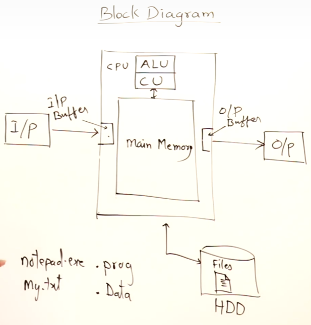

# How computer work ?

    

- **CPU (Center Processing Unit)** เป็นตัวประมวลผลสำหรับคอมพิวเตอร์ โดยด้านในจะประกอบไปด้วย
  - *ALU (Arithmetic Logical Unit)* ประมวลผลการดำเนินการทางคณิตศาสตร์ (+, -, x, /, %, <, >, =, and, or)
  - *CU (Control Unit)* ทำหน้าที่เชื่อมต่อหน่วยประมวลผลเข้ากับอุปกรณ์อื่น ๆ (Input device, Output Device, Storage)
- **HDD (Hardisk Drive)** ใช้สำหรับจัดเก็บข้อมูลในรูปแบบไฟล์ โดยไฟล์จะถูกแบ่งออกเป็น 2 ประเภท
  - 1. *Program File* เป็นชุดคำสั่งที่ใช้ในการสั่งงานคอมพิวเตอร์ เช่น Notepad.exe
  - 2. *Data File* เป็นข้อมูลดิบที่ถูกจัดเก็บไว้เพื่อนำไปประมวลผลด้านในโปรแกรมต่อ เช่น Note.txt
- **Main Memory** เมื่อเรามีการเรียกใช้โปรแกรมใด ๆ ก็ตาม โปรแกรมนั้นจะถูกนำมาเก็บไว้ในหน่วยความจำหลัก และหน่วยประมวลผลจะเข้ามาอ่านคำสั่งจากที่นี่ และดำเนินการประมวลผลทีละคำสั่ง

*Input/Output device จะมีหน่วยความจำของตัวเองด้วย ชื่อ Input buffer และ Output buffer*